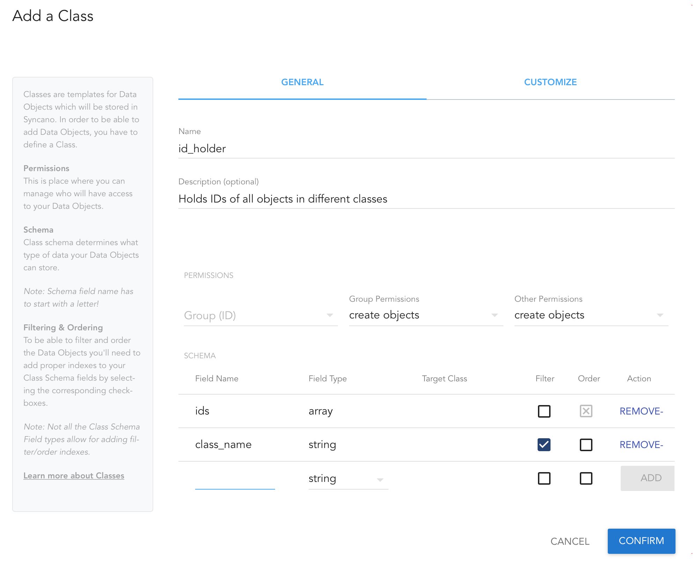
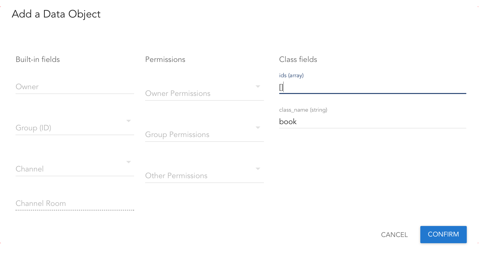
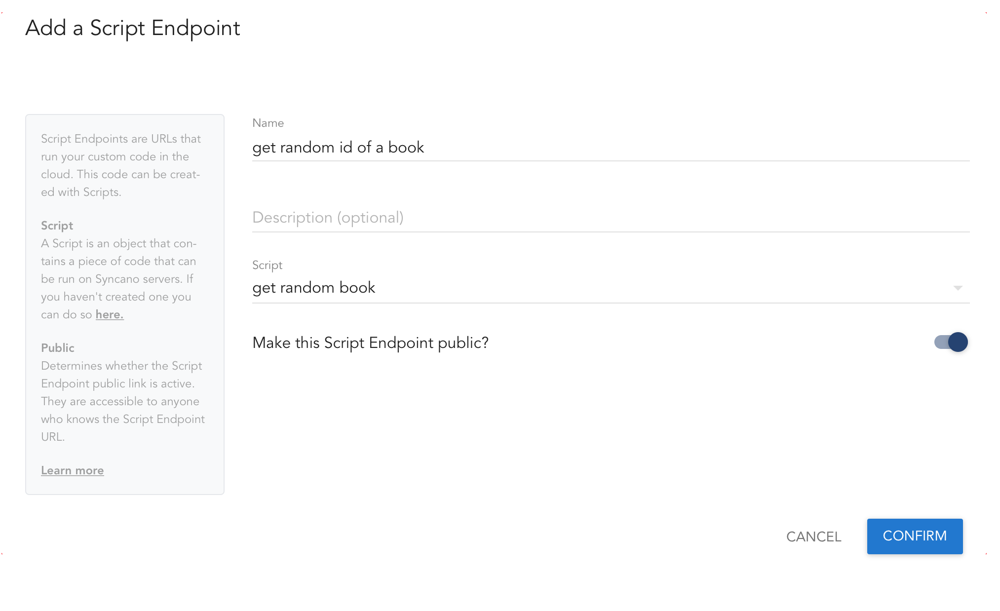
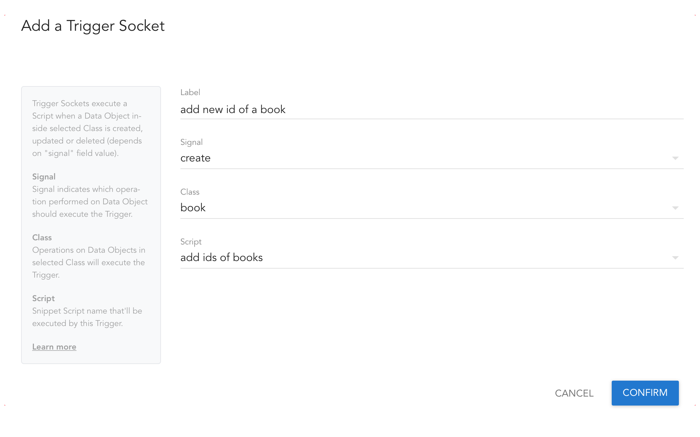
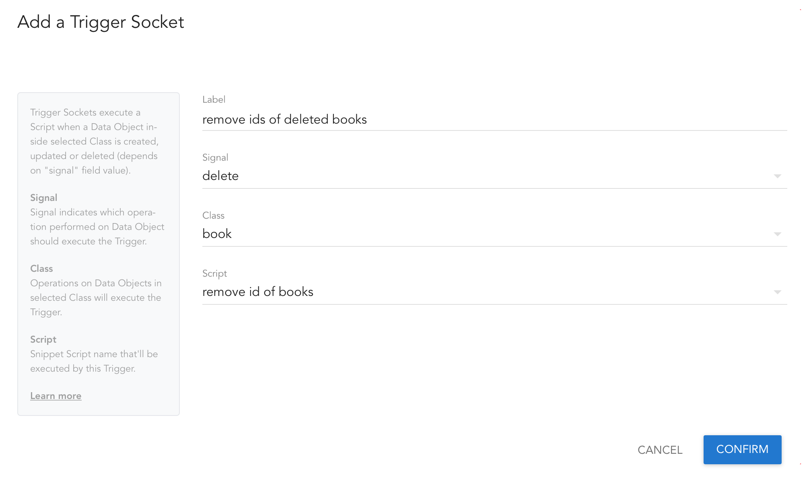

# Get random object from chosen Syncano class

Combination of a few script that let you download random objects from selected class from Syncano.

## Create `id_holder` class

To use scripts in this repo, you will first need to create a class that will hold IDs of objects in other classes. To not have to change anything in my code, name it `id_holder` and add in there following fields:

- `ids` , type: `array`
- `class_name`, type: `string`, `filter index` on

 

## Add objects to `id_holder` class

After class is added, go inside and create an object for every class you want to store IDs of. E.g. if you want to store IDs of classes `book` and `author`, create two objects, one for each class. 

Make sure to fill in class fields:

- `ids` - set it to an empty array - `[]`
- `clas_name` - set to the name of the class, in our case `book` for first objects, and `author` for second object



## Add Scripts

Now, create 3 scripts. Take the scripts available in this repo, and copy them into Syncano. Go into Scripts section of your [Dashboard](https://dashboard.syncano.io) and create 3 new Scripts with NodeJS runtime environment.

- [`add_id_from_class.js`](add_id_from_class.js) - make sure to replace API Key with your key with Ignore ACL setting, as well as class name (set it e.g. to `book`)
- [`remove_id_from_class.js`](remove_id_from_class.js) - make sure to replace API Key with your key with Ignore ACL setting, as well as class name (set it e.g. to `book`)
- [`get_random_id_from_class.js`](get_random_id_from_class.js) - make sure to replace API Key with your key with Ignore ACL setting, as well as class name (set it e.g. to `book`)

## Add Sockets

Now, go to Sockets section of your [Dashboard](https://dashboard.syncano.io), and create 3 new Sockets:

- Script Endpoint, for getting random IDs of your object, make sure to set public endpoint setting to `on`



- Trigger, for adding IDs of new objects



- Trigger, for removing IDs of deleted objects



That's it. Now you can start adding and removing objects to your class (e.g. `book` class), and `id_holder` class will be storing IDs of existing objects. 
Every time you add new object it will add its ID, every time you delete an object, its ID will be removed.

You can take your public script endpoint and run it in your browser anytime, to get a random ID of existing objects from your selected class.

Please remember, that for each class (e.g. separately for `book` and `author`) you want to store IDs of, you will need a copy of these script, and copy of Sockets (each class will require 1 Script Endpoint and 2 Triggers).

## Swift Example

Here's an example of getting a random book, displaying it then incrementing its key and diplaying it again - all in Swift.

```swift
Syncano.sharedInstanceWithApiKey("KEY WITH IGNORE ACL", instanceName: "INSTANCE_NAME")
SCScriptEndpoint.runPublicScriptEndpointWithURLString("https://api.syncano.io/v1.1/instances/syncano-support/endpoints/scripts/p/32e7a2452025158941345043d954b643447b0c50/get_random_book_id/", payload: [:]) { response, error in
   if let result = response?.result! as? [String:String],
      let random_id = result["stdout"] {
         let book = Book()
         book.objectId = Int(random_id)
         book.fetchWithCompletion { error in
            print("\(error)")
            //display book here
            print(book)
            book.incrementKey("age", by: 1, withCompletion: { error in
               print("\(error)")
               //display book after increment
               print(book)
            })
         }
   }
}
``` 

Hope it helps! If you have any questions, ping me on [Twitter](https://twitter.com/lifcio).
